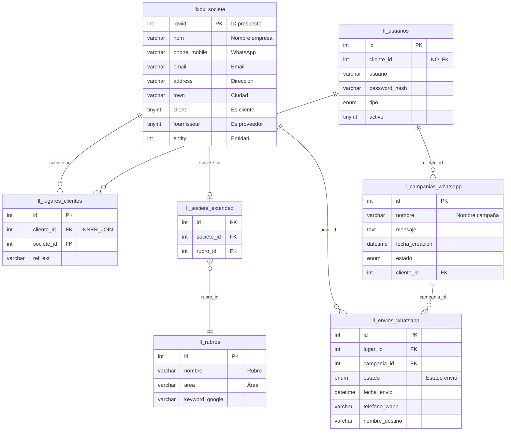
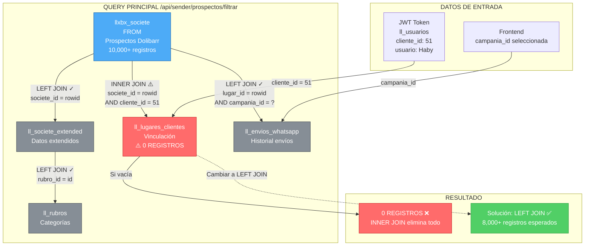
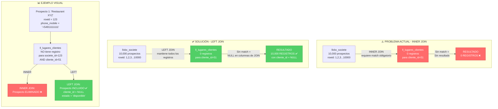

# 🗄️ TABLAS DEL FORMULARIO "SELECCIONAR PROSPECTOS"

**Formulario:** Selector de Prospectos  
**Endpoint:** `/api/sender/prospectos/filtrar`  
**Fecha:** 2026-02-11

---

## 📊 TABLAS PRINCIPALES

### 1. **llxbx_societe** (Tabla FROM - Dolibarr)

**Alias:** `s`  
**Tipo:** Tabla principal  
**Origen:** Dolibarr ERP  
**Propósito:** Contiene toda la información de empresas/prospectos/clientes

#### Columnas utilizadas:
| Columna | Alias en SELECT | Descripción | Tipo |
|---------|----------------|-------------|------|
| `rowid` | `id` | ID único del prospecto | INT (PK) |
| `nom` | `nombre` | Nombre de la empresa | VARCHAR |
| `phone_mobile` | `telefono_wapp` | Teléfono/WhatsApp | VARCHAR |
| `email` | `email` | Email de contacto | VARCHAR |
| `address` | `direccion` | Dirección física | VARCHAR |
| `town` | `ciudad` | Ciudad | VARCHAR |
| `client` | `es_cliente` | Si es cliente (1) o no (0) | TINYINT |
| `fournisseur` | `es_proveedor` | Si es proveedor (1) o no (0) | TINYINT |
| `entity` | - | Entidad (multi-empresa) | INT |

#### Filtros aplicados:
- ✅ `entity = 1` (solo entidades activas)
- ✅ `phone_mobile IS NOT NULL AND phone_mobile != ''` (solo con WhatsApp válido)
- ✅ `nom LIKE '%busqueda%'` (búsqueda por nombre)
- ✅ `address LIKE '%direccion%'` (filtro por dirección)
- ✅ `client = 1` (filtro por tipo de cliente)

---

### 2. **ll_lugares_clientes** (INNER JOIN) ⚠️

**Alias:** `lc`  
**Tipo:** Tabla de vinculación cliente-prospecto  
**Origen:** LeadMaster custom  
**Propósito:** Relacionar qué prospectos puede ver cada cliente

#### Columnas utilizadas:
| Columna | Uso | Descripción |
|---------|-----|-------------|
| `societe_id` | JOIN | FK a llxbx_societe.rowid |
| `cliente_id` | JOIN + SELECT | FK a ll_clientes.id |

#### JOIN:
```sql
INNER JOIN ll_lugares_clientes lc 
  ON lc.societe_id = s.rowid 
  AND lc.cliente_id = ? (parámetro del usuario autenticado)
```

#### ⚠️ PROBLEMA ACTUAL:
- Este INNER JOIN **requiere** que el prospecto esté vinculado al cliente
- Si la tabla está vacía para el cliente → 0 resultados
- Debería ser **LEFT JOIN** para mostrar todos los prospectos

---

### 3. **ll_societe_extended** (LEFT JOIN)

**Alias:** `se`  
**Tipo:** Tabla de extensión  
**Origen:** LeadMaster custom  
**Propósito:** Datos adicionales de prospectos no incluidos en Dolibarr

#### Columnas utilizadas:
| Columna | Uso | Descripción |
|---------|-----|-------------|
| `societe_id` | JOIN | FK a llxbx_societe.rowid |
| `rubro_id` | JOIN (indirecto) | FK a ll_rubros.id |

#### JOIN:
```sql
LEFT JOIN ll_societe_extended se 
  ON se.societe_id = s.rowid
```

#### ✅ Estado: Correcto (LEFT JOIN permite prospectos sin datos extendidos)

---

### 4. **ll_rubros** (LEFT JOIN)

**Alias:** `r`  
**Tipo:** Catálogo de rubros/categorías  
**Origen:** LeadMaster custom  
**Propósito:** Clasificación de empresas por rubro de negocio

#### Columnas utilizadas:
| Columna | Alias en SELECT | Descripción |
|---------|----------------|-------------|
| `id` | - | ID del rubro | 
| `nombre` | `rubro` | Nombre del rubro (ej: "Restaurante") |
| `area` | `area_rubro` | Área del rubro (ej: "Gastronomía") |
| `keyword_google` | - | Palabras clave para búsquedas |

#### JOIN:
```sql
LEFT JOIN ll_rubros r 
  ON se.rubro_id = r.id
```

#### Filtros aplicados:
- ✅ `COALESCE(r.nombre, 'Sin rubro') LIKE '%rubro%'` (filtro por rubro)
- ✅ `r.area LIKE '%area%'` (filtro por área)

#### ✅ Estado: Correcto (LEFT JOIN permite prospectos sin rubro asignado)

---

### 5. **ll_envios_whatsapp** (LEFT JOIN)

**Alias:** `env`  
**Tipo:** Historial de envíos de WhatsApp  
**Origen:** LeadMaster custom  
**Propósito:** Registrar envíos de mensajes y su estado

#### Columnas utilizadas:
| Columna | Uso | Descripción |
|---------|-----|-------------|
| `id` | Agregación (MAX) | ID del envío |
| `lugar_id` | JOIN | FK a llxbx_societe.rowid |
| `campania_id` | JOIN (filtro) | FK a ll_campanias.id |
| `estado` | SELECT (MAX) | Estado del envío |
| `fecha_envio` | SELECT (MAX) | Fecha del último envío |

#### JOIN:
```sql
LEFT JOIN ll_envios_whatsapp env 
  ON env.lugar_id = s.rowid 
  AND env.campania_id = ? (parámetro de campaña seleccionada)
```

#### Estado calculado:
```sql
CASE 
  WHEN MAX(env.id) IS NOT NULL THEN MAX(env.estado)
  ELSE 'disponible'
END as estado
```

**Posibles estados:**
- `disponible` - Prospecto sin envíos en esta campaña
- `enviado` - Mensaje enviado exitosamente
- `pendiente` - Mensaje en cola de envío
- `error` - Error en el envío

#### Filtros aplicados en HAVING:
- ✅ `MAX(env.id) IS NULL` (filtro: sin envíos)
- ✅ `MAX(env.estado) = 'enviado'` (filtro: enviados)
- ✅ `MAX(env.estado) = 'pendiente'` (filtro: pendientes)

#### ✅ Estado: Correcto (LEFT JOIN permite prospectos sin envíos previos)

---

## 🔗 RELACIONES ENTRE TABLAS

### Diagrama ASCII (simple)

```
┌─────────────────────┐
│  llxbx_societe (s)  │ ← Tabla principal (Dolibarr)
│  Prospectos/Clientes│
└──────────┬──────────┘
           │
           │ INNER JOIN ⚠️ (PROBLEMA)
           │ lc.societe_id = s.rowid
           │ AND lc.cliente_id = ?
           ▼
┌─────────────────────┐
│ ll_lugares_clientes │
│  (lc)               │
│  Vinculación cliente│
└─────────────────────┘
           │
           │ LEFT JOIN ✓
           │ se.societe_id = s.rowid
           ▼
┌─────────────────────┐
│ ll_societe_extended │
│  (se)               │
│  Datos adicionales  │
└──────────┬──────────┘
           │
           │ LEFT JOIN ✓
           │ r.id = se.rubro_id
           ▼
┌─────────────────────┐
│    ll_rubros (r)    │
│  Categorización     │
└─────────────────────┘

┌─────────────────────┐
│  llxbx_societe (s)  │
└──────────┬──────────┘
           │
           │ LEFT JOIN ✓
           │ env.lugar_id = s.rowid
           │ AND env.campania_id = ?
           ▼
┌─────────────────────┐
│ ll_envios_whatsapp  │
│  (env)              │
│  Historial envíos   │
└─────────────────────┘
```

### Diagrama ER Completo



### Flujo del Query



### Comparación INNER JOIN vs LEFT JOIN



---

## 📋 TABLAS AUXILIARES (No en el query principal)

Estas tablas se consultan en endpoints separados para poblar los filtros:

### 6. **ll_campanias_whatsapp** ✅ NOMBRE CORRECTO

**Endpoint:** `/api/sender/campanias`  
**Propósito:** Lista de campañas disponibles  
**Uso en formulario:** Dropdown "Campaña de destino"

#### Estructura:
```sql
CREATE TABLE `ll_campanias_whatsapp` (
  `id` int(11) NOT NULL,
  `nombre` varchar(255) NOT NULL,
  `mensaje` text NOT NULL,
  `fecha_creacion` datetime DEFAULT current_timestamp(),
  `estado` enum('pendiente','en_progreso','finalizado'),
  `cliente_id` int(11) DEFAULT NULL
);
```

#### Columnas mostradas:
- `id` - ID de la campaña
- `nombre` - Nombre de la campaña
- `cliente_id` - Cliente propietario de la campaña

---

### 7. **ll_usuarios**

**Uso:** Autenticación JWT  
**Propósito:** Datos del usuario autenticado

#### Estructura:
```sql
CREATE TABLE `ll_usuarios` (
  `id` int(11) NOT NULL,
  `cliente_id` int(11) DEFAULT NULL,
  `usuario` varchar(100) NOT NULL,
  `password_hash` varchar(255) NOT NULL,
  `tipo` enum('cliente','admin'),
  `activo` tinyint(1) DEFAULT 1
);
```

#### Datos extraídos del token JWT:
- `id` - ID del usuario (ll_usuarios.id)
- `cliente_id` - ID numérico del cliente ⚠️ NO tiene tabla ll_clientes
- `usuario` - Nombre de usuario
- `tipo` - Tipo de usuario (cliente/admin)

**Ejemplo:**
```json
{
  "id": 2,
  "cliente_id": 51,
  "usuario": "Haby",
  "tipo": "cliente"
}
```

---

## 🎯 FLUJO DE DATOS

```
1. Usuario selecciona campaña
   ↓
2. Frontend llama: GET /api/sender/prospectos/filtrar?campania_id=XX
   ↓
3. Backend extrae: req.user.cliente_id (del JWT)
   ↓
4. Query ejecuta JOINs:
   
   llxbx_societe (todos los prospectos)
        ↓
   INNER JOIN ll_lugares_clientes ← FILTRA por cliente_id ⚠️
        ↓
   LEFT JOIN ll_societe_extended
        ↓
   LEFT JOIN ll_rubros
        ↓
   LEFT JOIN ll_envios_whatsapp ← FILTRA por campania_id
        ↓
5. Aplica filtros WHERE (área, rubro, dirección, tipo_cliente)
   ↓
6. Agrupa por prospecto con GROUP BY
   ↓
7. Aplica filtros HAVING (estado: sin_envio, enviado, pendiente)
   ↓
8. Devuelve JSON con array de prospectos
```

---

## 📊 RESUMEN DE TABLAS

| # | Tabla | Tipo JOIN | Origen | Propósito | Estado |
|---|-------|-----------|--------|-----------|--------|
| 1 | `llxbx_societe` | FROM | Dolibarr | Prospectos principales | ✅ Correcto |
| 2 | `ll_lugares_clientes` | **INNER JOIN** | LeadMaster | Vinculación cliente-prospecto | ⚠️ **PROBLEMA** |
| 3 | `ll_societe_extended` | LEFT JOIN | LeadMaster | Datos extendidos | ✅ Correcto |
| 4 | `ll_rubros` | LEFT JOIN | LeadMaster | Categorías/rubros | ✅ Correcto |
| 5 | `ll_envios_whatsapp` | LEFT JOIN | LeadMaster | Historial de envíos | ✅ Correcto |
| 6 | `ll_campanias_whatsapp` | (separado) | LeadMaster | Lista de campañas | ✅ Correcto |
| 7 | `ll_usuarios` | (JWT) | LeadMaster | Autenticación | ✅ Correcto |

⚠️ **NOTA:** La tabla `ll_clientes` NO EXISTE - el campo `cliente_id` es solo un ID numérico sin tabla maestra.

---

## 🔧 CAMPOS MOSTRADOS EN EL FORMULARIO

### Tabla de prospectos (columnas visibles):

| Columna UI | Campo DB | Tabla origen |
|------------|----------|--------------|
| **Empresa** | `s.nom` | llxbx_societe |
| (Rubro) | `r.nombre` | ll_rubros |
| (Área) | `r.area` | ll_rubros |
| **Estado** | `MAX(env.estado)` o 'disponible' | ll_envios_whatsapp |
| **Teléfono/WhatsApp** | `s.phone_mobile` | llxbx_societe |
| **Dirección** | `s.address` | llxbx_societe |
| (Ciudad) | `s.town` | llxbx_societe |

### Filtros disponibles:

| Filtro UI | Campo DB | Tabla origen |
|-----------|----------|--------------|
| Campaña de destino | Parámetro `campania_id` | ll_campanias |
| Buscar | `s.nom LIKE` | llxbx_societe |
| Área | `r.area` | ll_rubros |
| Rubro | `r.nombre` | ll_rubros |
| Estado | `MAX(env.estado)` | ll_envios_whatsapp |
| Tipo de cliente | `s.client`, `s.fournisseur` | llxbx_societe |
| Dirección contiene | `s.address LIKE` | llxbx_societe |

---

## 🚨 PROBLEMA IDENTIFICADO

**Tabla problemática:** `ll_lugares_clientes` con **INNER JOIN**

**Impacto:**
```sql
INNER JOIN ll_lugares_clientes lc 
  ON lc.societe_id = s.rowid 
  AND lc.cliente_id = 51
```

Si esta tabla NO tiene registros para `cliente_id = 51`:
- ❌ El INNER JOIN elimina TODOS los prospectos
- ❌ El resultado es 0 registros
- ❌ El usuario ve "No se encontraron prospectos"

**Solución:** Cambiar a `LEFT JOIN`

---

**Generado:** 2026-02-11  
**Estado:** Documentación completa del modelo de datos del formulario
