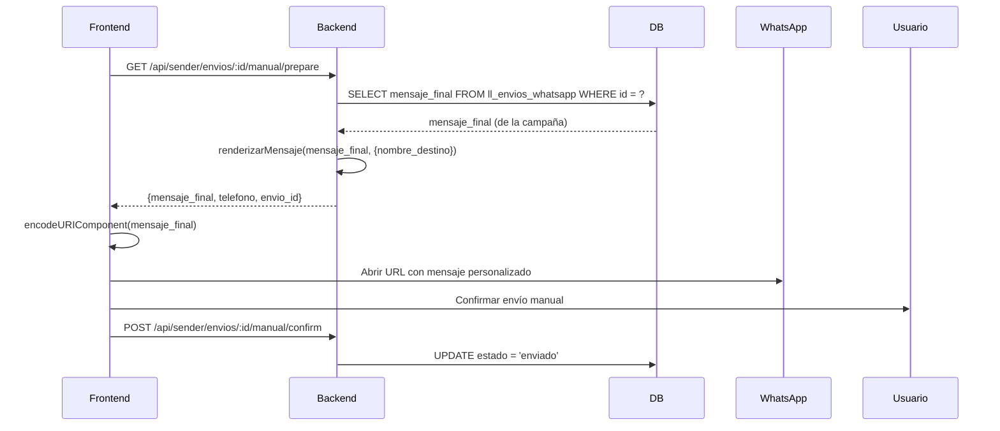
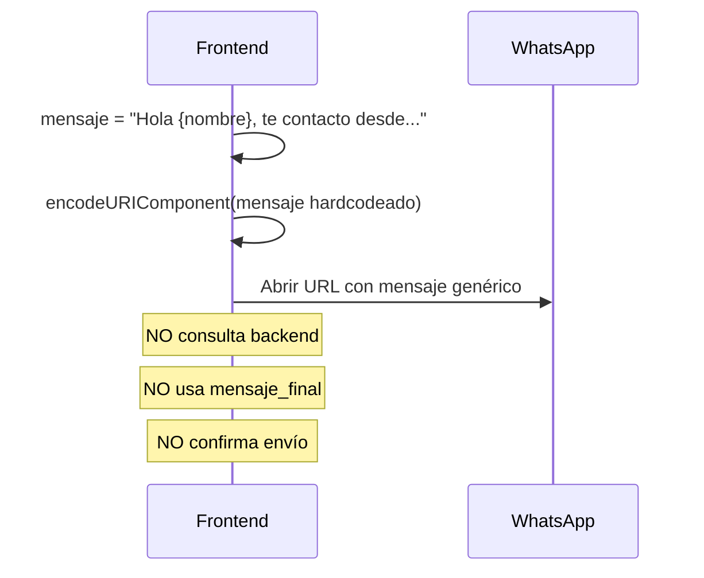

# 🔴 Diagnóstico Crítico: Mensaje Hardcodeado en Envío Manual WhatsApp

**Fecha:** 16 de febrero de 2026  
**Proyecto:** LeadMaster - Central Hub  
**Módulo:** Envíos WhatsApp - Modo Manual  
**Severidad:** 🔴 **CRÍTICA** - Funcionalidad incorrecta  
**Estado:** 🔍 Diagnosticado - En espera de corrección

---

## 🎯 Problema Identificado

El módulo de **Gestión de Destinatarios** (`GestionDestinatariosPage.jsx`) NO está usando el mensaje de la campaña almacenado en `ll_envios_whatsapp.mensaje_final`. En su lugar, utiliza un **mensaje genérico hardcodeado** en el frontend, ignorando completamente el contenido personalizado de la campaña.

### Síntoma

✅ **Esperado:** Al hacer clic en "Abrir WhatsApp", debería usar el mensaje de la campaña con variables personalizadas.  
❌ **Actual:** Se envía siempre: `"Hola {nombre}, te contacto desde Desarrollo y Diseño."`

---

## 📍 Punto Exacto del Error

### Archivo Problemático

**Ruta:** [`frontend/src/components/destinatarios/GestionDestinatariosPage.jsx`](frontend/src/components/destinatarios/GestionDestinatariosPage.jsx)

### Líneas Críticas

#### 1. Función `handleAbrirModalWhatsApp` (Línea 161-169)

```javascript
const handleAbrirModalWhatsApp = (prospecto) => {
  // ❌ PROBLEMA: No consulta al backend
  // ❌ PROBLEMA: No obtiene mensaje_final de la base de datos
  
  if (!prospecto.telefono_wapp || prospecto.telefono_wapp.trim() === '') {
    alert('Este prospecto no tiene teléfono de WhatsApp');
    return;
  }

  setProspectoSeleccionado(prospecto);
  setMostrarModalWhatsApp(true);
};
```

**Problema:** Solo toma el prospecto del estado local y abre el modal. No hace ninguna llamada al backend para obtener el mensaje de la campaña.

---

#### 2. Función `handleConfirmarWhatsApp` (Línea 172-201)

```javascript
const handleConfirmarWhatsApp = async () => {
  if (!prospectoSeleccionado) return;

  try {
    const telefonoNormalizado = prospectoSeleccionado.telefono_wapp.replace(/\D/g, '');

    // ❌ MENSAJE HARDCODEADO AQUÍ
    const mensaje = `Hola ${prospectoSeleccionado.nombre}, te contacto desde Desarrollo y Diseño.`;
    // ❌ FIN DEL PROBLEMA

    const mensajeCodificado = encodeURIComponent(mensaje);
    const urlWhatsApp = `https://web.whatsapp.com/send?phone=${telefonoNormalizado}&text=${mensajeCodificado}`;

    // TODO comentado: No registra el envío
    // await api.post('/sender/envios/:id/manual/confirm', ...);

    window.open(urlWhatsApp, '_blank');
    setMostrarModalWhatsApp(false);
    setProspectoSeleccionado(null);

  } catch (error) {
    console.error('Error al procesar envío:', error);
    alert('Error al registrar el envío');
  }
};
```

**Problemas:**
1. ❌ Mensaje hardcodeado en línea 180-181
2. ❌ No usa `mensaje_final` de `ll_envios_whatsapp`
3. ❌ No llama a endpoint `/sender/envios/:id/manual/prepare`
4. ❌ No obtiene datos del backend
5. ❌ Comentario TODO indica funcionalidad incompleta

---

#### 3. Modal con Mensaje Hardcodeado (Línea 428-430)

```jsx
<div>
  <label className="block text-sm font-medium text-gray-700 mb-1">
    Mensaje
  </label>
  <p className="text-sm text-gray-600 bg-gray-50 p-3 rounded-lg">
    Hola {prospectoSeleccionado.nombre}, te contacto desde Desarrollo y Diseño.
  </p>
</div>
```

**Problema:** El modal muestra el mismo mensaje hardcodeado en la vista previa.

---

## ✅ Implementación Correcta (Referencia)

### Archivo de Referencia

**Ruta:** [`frontend/src/components/admin/GestorDestinatarios.jsx`](frontend/src/components/admin/GestorDestinatarios.jsx)

Este componente SÍ implementa correctamente el flujo.

### Función `handlePrepararEnvioManual` (Línea 127-149)

```javascript
const handlePrepararEnvioManual = async (destinatario) => {
  setLoadingButtons(prev => ({ ...prev, [destinatario.id]: true }));
  
  try {
    // ✅ CORRECTO: Llama al backend para preparar el envío
    const response = await enviosService.prepareManual(destinatario.id);
    
    if (response.success) {
      // ✅ CORRECTO: Recibe mensaje_final del backend
      setDatosEnvioPreparado(response.data);
      setShowModalConfirmarEnvio(true);
    }
  } catch (error) {
    alert('Error al preparar envío: ' + (error.response?.data?.message || error.message));
  } finally {
    setLoadingButtons(prev => ({ ...prev, [destinatario.id]: false }));
  }
};
```

### Función `handleConfirmarEnvioManual` (Línea 162-188)

```javascript
const handleConfirmarEnvioManual = async () => {
  if (!datosEnvioPreparado) return;

  try {
    // ✅ CORRECTO: Usa mensaje_final del backend
    const urlWhatsApp = `https://web.whatsapp.com/send?phone=${datosEnvioPreparado.telefono}&text=${encodeURIComponent(datosEnvioPreparado.mensaje_final)}`;
    
    window.open(urlWhatsApp, '_blank');
    setShowModalConfirmarEnvio(false);

    setTimeout(() => {
      const confirmado = window.confirm('¿Ya enviaste el mensaje por WhatsApp? Presiona OK para confirmar.');
      
      if (confirmado) {
        confirmarEstadoEnviado(); // ✅ Llama a confirmManual
      } else {
        alert('El envío fue cancelado. El estado permanece como pendiente.');
        setDatosEnvioPreparado(null);
      }
    }, 2000);

  } catch (error) {
    alert('Error al abrir WhatsApp: ' + error.message);
    setDatosEnvioPreparado(null);
  }
};
```

**Diferencia clave:** Usa `datosEnvioPreparado.mensaje_final` obtenido del backend.

---

## 🔍 Flujo Completo Correcto vs Actual

### Flujo Esperado (GestorDestinatarios.jsx) ✅



### Flujo Actual (GestionDestinatariosPage.jsx) ❌



---

## 🔎 Verificación del Backend

### Endpoint de Preparación (Funciona Correctamente) ✅

**Archivo:** [`src/modules/sender/controllers/enviosController.js`](src/modules/sender/controllers/enviosController.js)  
**Función:** `prepareManual` (Línea 33-125)

```javascript
exports.prepareManual = async (req, res) => {
  try {
    const { id: envioId } = req.params;
    const clienteId = req.user?.cliente_id;

    // Obtener envío con datos de campaña
    const [envios] = await pool.execute(`
      SELECT 
        env.id,
        env.campania_id,
        env.telefono_wapp,
        env.nombre_destino,
        env.mensaje_final,  -- ✅ Se obtiene de la base de datos
        env.estado,
        camp.nombre as campania_nombre,
        camp.cliente_id
      FROM ll_envios_whatsapp env
      INNER JOIN ll_campanias_whatsapp camp ON env.campania_id = camp.id
      WHERE env.id = ? AND camp.cliente_id = ?
    `, [envioId, clienteId]);

    const envio = envios[0];

    // Renderizar mensaje reemplazando variables
    const mensajePersonalizado = renderizarMensaje(envio.mensaje_final, {
      nombre_destino: envio.nombre_destino
    });

    // Retornar datos preparados
    res.json({
      success: true,
      data: {
        envio_id: envio.id,
        campania_id: envio.campania_id,
        campania_nombre: envio.campania_nombre,
        telefono: telefonoNormalizado,
        nombre_destino: envio.nombre_destino,
        mensaje_final: mensajePersonalizado  -- ✅ Devuelve mensaje personalizado
      }
    });

  } catch (error) {
    console.error('Error en prepareManual:', error);
    res.status(500).json({ success: false, message: 'Error interno del servidor' });
  }
};
```

**Estado:** ✅ **Funciona correctamente** - Devuelve `mensaje_final` personalizado.

---

### Controlador de Inclusión (Funciona Correctamente) ✅

**Archivo:** [`src/modules/sender/controllers/destinatariosController.js`](src/modules/sender/controllers/destinatariosController.js)  
**Función:** `agregarDestinatarios` (Línea 94-255)

```javascript
// Obtener mensaje de la campaña
const [campaniaCheck] = await db.execute(
  'SELECT id, nombre, mensaje FROM ll_campanias_whatsapp WHERE id = ? AND cliente_id = ?',
  [campaniaId, clienteId]
);

const campania = campaniaCheck[0];
const mensajeFinal = campania.mensaje ? campania.mensaje.trim() : null;  -- ✅ Se obtiene de la campaña

// Insertar destinatarios
const [result] = await db.execute(`
  INSERT INTO ll_envios_whatsapp 
  (campania_id, telefono_wapp, nombre_destino, mensaje_final, estado, lugar_id)
  VALUES (?, ?, ?, ?, 'pendiente', ?)
`, [
  campaniaId, 
  telefonoLimpio, 
  dest.nombre_destino || null, 
  mensajeFinal,  -- ✅ Se guarda mensaje de la campaña
  dest.lugar_id || null
]);
```

**Estado:** ✅ **Funciona correctamente** - Inserta `mensaje_final` de la campaña.

---

### Servicio Frontend (Implementado Correctamente) ✅

**Archivo:** [`frontend/src/services/envios.js`](frontend/src/services/envios.js)  
**Función:** `prepareManual` (Línea 16-26)

```javascript
async prepareManual(envioId) {
  try {
    const response = await apiService.get(`/sender/envios/${envioId}/manual/prepare`);
    return response.data;  // ✅ Devuelve {success, data: {mensaje_final, ...}}
  } catch (error) {
    console.error('Error al preparar envío manual:', error);
    throw error;
  }
}
```

**Estado:** ✅ **Implementado correctamente** - Pero NO se usa en `GestionDestinatariosPage.jsx`.

---

## 📊 Tabla Comparativa: Componentes

| Aspecto | GestorDestinatarios.jsx ✅ | GestionDestinatariosPage.jsx ❌ |
|---------|---------------------------|--------------------------------|
| **Llama a backend** | ✅ Sí - `prepareManual()` | ❌ No |
| **Obtiene mensaje_final** | ✅ Desde base de datos | ❌ Hardcodeado |
| **Personaliza mensaje** | ✅ Variables reemplazadas | ❌ Texto genérico |
| **Normaliza teléfono** | ✅ Backend normaliza | ⚠️ Frontend normaliza |
| **Confirma envío** | ✅ Llama `confirmManual()` | ❌ TODO comentado |
| **Cambia estado** | ✅ A 'enviado' | ❌ No cambia |
| **Auditoría completa** | ✅ Registra en BD | ❌ No registra |

---

## 🔍 Variables Involucradas

### Variable Que SE DEBERÍA USAR
```javascript
// Debe venir del backend:
datosEnvioPreparado.mensaje_final

// Ejemplo de contenido (desde ll_envios_whatsapp):
"Hola Juan Pérez, te contactamos desde IUNA para informarte sobre nuestras carreras de diseño..."
```

### Variable Que SE ESTÁ USANDO (INCORRECTA)
```javascript
// Hardcodeada en frontend:
const mensaje = `Hola ${prospectoSeleccionado.nombre}, te contacto desde Desarrollo y Diseño.`

// Ejemplo de contenido:
"Hola Juan Pérez, te contacto desde Desarrollo y Diseño."
```

---

## 📂 Archivos Involucrados

### Frontend

1. **❌ ARCHIVO CON ERROR**
   - **Ruta:** `frontend/src/components/destinatarios/GestionDestinatariosPage.jsx`
   - **Líneas críticas:** 161-169, 180-181, 428-430
   - **Problema:** Mensaje hardcodeado, no usa backend

2. **✅ ARCHIVO CORRECTO (Referencia)**
   - **Ruta:** `frontend/src/components/admin/GestorDestinatarios.jsx`
   - **Líneas clave:** 140-149, 166
   - **Estado:** Implementación correcta

3. **✅ SERVICIO DISPONIBLE**
   - **Ruta:** `frontend/src/services/envios.js`
   - **Función:** `prepareManual(envioId)`
   - **Estado:** Funciona correctamente, pero no se usa

### Backend

4. **✅ ENDPOINT CORRECTO**
   - **Ruta:** `src/modules/sender/controllers/enviosController.js`
   - **Función:** `prepareManual` (línea 33-125)
   - **Endpoint:** `GET /api/sender/envios/:id/manual/prepare`
   - **Estado:** Funciona correctamente

5. **✅ CONTROLADOR DE INCLUSIÓN**
   - **Ruta:** `src/modules/sender/controllers/destinatariosController.js`
   - **Función:** `agregarDestinatarios` (línea 94-255)
   - **Estado:** Inserta `mensaje_final` correctamente

---

## 🎭 Escenarios de Fallo

### Escenario 1: Campaña de IUNA Diseño ❌ FALLA

**Configuración:**
- **Campaña:** "Difusión Carreras IUNA 2026"
- **Mensaje configurado en DB:**  
  ```
  Hola {{nombre_destino}}, te contactamos desde el Instituto Universitario Nacional del Arte.
  Te invitamos a conocer nuestras carreras de diseño gráfico y multimedial.
  Más info: www.iuna.edu.ar
  ```

**Resultado esperado:**  
"Hola Juan Pérez, te contactamos desde el Instituto Universitario Nacional del Arte..."

**Resultado actual:**  
"Hola Juan Pérez, te contacto desde Desarrollo y Diseño."

**Impacto:** ❌ **Cliente recibe mensaje incorrecto** - Confusión y pérdida de credibilidad.

---

### Escenario 2: Campaña de Navidad 2025 ❌ FALLA

**Configuración:**
- **Campaña:** "Saludos Navidad 2025"
- **Mensaje configurado en DB:**  
  ```
  🎄 Hola {{nombre_destino}}! 
  El equipo de Desarrollo y Diseño te desea una Feliz Navidad 🎅
  y un próspero 2026. Gracias por confiar en nosotros!
  ```

**Resultado esperado:**  
"🎄 Hola ACME Corp! El equipo de Desarrollo y Diseño te desea una Feliz Navidad..."

**Resultado actual:**  
"Hola ACME Corp, te contacto desde Desarrollo y Diseño."

**Impacto:** ❌ **Mensaje genérico no festivo** - Pérdida de personalización.

---

## 💥 Impacto del Problema

### 🔴 Severidad Crítica

| Nivel | Descripción |
|-------|-------------|
| **Funcionalidad** | ❌ Módulo no funciona según lo diseñado |
| **Datos** | ⚠️ Se ignora `mensaje_final` de la base de datos |
| **UX** | ❌ Usuario no puede enviar mensajes personalizados |
| **Cliente** | 🔴 Recibe mensajes incorrectos/genéricos |
| **Credibilidad** | 🔴 Pérdida de confianza del destinatario |
| **ROI Campañas** | 📉 Menor efectividad de las campañas |

### Consecuencias Directas

1. ❌ **Todas las campañas** enviadas desde "Gestión de Destinatarios" usan el mismo texto genérico
2. ❌ **Configuración de mensajes** en `ll_campanias_whatsapp.mensaje` es inútil
3. ❌ **Variables personalizadas** no funcionan (ej: `{{nombre_destino}}`, `{{lugar}}`)
4. ❌ **Clientes reciben mensajes inconsistentes** con la campaña configurada
5. ❌ **No se registra auditoría** del envío manual

---

## 🔄 Diferencia entre Flujo Esperado vs Actual

### FLUJO ESPERADO ✅

```
1. Usuario hace clic en "Web WhatsApp"
2. Frontend → Backend: GET /api/sender/envios/:id/manual/prepare
3. Backend → DB: SELECT mensaje_final FROM ll_envios_whatsapp WHERE id = :id
4. Backend: renderizarMensaje(mensaje_final, {nombre_destino: "Juan Pérez"})
5. Backend → Frontend: {mensaje_final: "Hola Juan Pérez, te contactamos desde IUNA..."}
6. Frontend: encodeURIComponent(mensaje_final)
7. Frontend: Abrir WhatsApp con mensaje personalizado
8. Usuario: Confirma envío manual
9. Frontend → Backend: POST /api/sender/envios/:id/manual/confirm
10. Backend → DB: UPDATE estado = 'enviado', fecha_envio = NOW()
```

### FLUJO ACTUAL ❌

```
1. Usuario hace clic en "Web WhatsApp"
2. Frontend: mensaje = "Hola Juan Pérez, te contacto desde Desarrollo y Diseño."
3. Frontend: encodeURIComponent(mensaje hardcodeado)
4. Frontend: Abrir WhatsApp con mensaje genérico
5. [FIN - No hay confirmación ni registro]
```

---

## 🛠️ Causa Raíz

### Implementación Incompleta

El componente `GestionDestinatariosPage.jsx` fue creado con un **flujo simplificado temporal** que nunca se completó.

**Evidencia:**
- Comentario TODO en línea 190-191:
  ```javascript
  // TODO: Registrar en ll_envios_whatsapp (pendiente TAREA 2 y 3)
  // await api.post('/sender/envios/:id/manual/confirm', ...);
  ```

**Conclusión:**  
El componente quedó con una implementación de prueba (POC) que nunca se refactorizó para usar el backend correctamente.

---

## 📋 Resumen Ejecutivo

### ✅ Lo que SÍ funciona

- ✅ Backend devuelve `mensaje_final` correctamente
- ✅ Base de datos almacena `mensaje_final` correctamente
- ✅ Servicio `enviosService` implementado correctamente
- ✅ Componente `GestorDestinatarios.jsx` funciona como debe
- ✅ Endpoint `/sender/envios/:id/manual/prepare` operativo

### ❌ Lo que NO funciona

- ❌ `GestionDestinatariosPage.jsx` no usa el backend
- ❌ Mensaje hardcodeado sobrescribe `mensaje_final`
- ❌ No se registra auditoría del envío
- ❌ No se cambia el estado a 'enviado'
- ❌ Variables personalizadas no se reemplazan

---

## 🎯 Conclusión

**Problema identificado:** El componente `GestionDestinatariosPage.jsx` tiene una implementación **incompleta** que usa un mensaje hardcodeado en lugar de consultar al backend y usar `mensaje_final` de la base de datos.

**Punto exacto del error:**
- **Archivo:** [`frontend/src/components/destinatarios/GestionDestinatariosPage.jsx`](frontend/src/components/destinatarios/GestionDestinatariosPage.jsx)
- **Función:** `handleConfirmarWhatsApp` (línea 172)
- **Línea crítica:** 180-181

**Variable incorrecta:**
```javascript
const mensaje = `Hola ${prospectoSeleccionado.nombre}, te contacto desde Desarrollo y Diseño.`;
```

**Variable correcta (debe provenir del backend):**
```javascript
datosEnvioPreparado.mensaje_final
```

**Solución necesaria:** Refactorizar `GestionDestinatariosPage.jsx` para seguir el mismo patrón que `GestorDestinatarios.jsx`:
1. Llamar a `enviosService.prepareManual(envioId)`
2. Obtener `mensaje_final` del backend
3. Usar `datosEnvioPreparado.mensaje_final` en la URL de WhatsApp
4. Confirmar el envío con `enviosService.confirmManual(envioId)`

---

**Estado:** 🔍 **Diagnóstico completo** - Listo para implementar corrección  
**Prioridad:** 🔴 **ALTA** - Afecta funcionalidad crítica de campañas  
**Próximo paso:** Implementar solución siguiendo patrón de `GestorDestinatarios.jsx`

---

**Fin del Diagnóstico**
